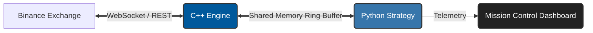
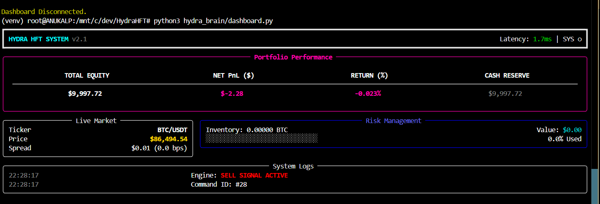

# 🐍 Hydra-HFT
### High-Frequency Hybrid Trading Engine (C++ / Python)

---

## ⚡ Overview

**Hydra** is an institutional-grade algorithmic trading system designed to bridge the gap between **low-latency execution** and **high-level statistical analysis**.

It solves the "Two Language Problem" in quantitative finance by decoupling the critical path:
* **Execution Layer (C++20):** Handles market data ingestion and order routing via WebSockets/REST.
* **Strategy Layer (Python):** Runs complex inference (Trend Following, LSTM-PPO) using the rich Python ecosystem.
* **The Bridge:** A custom **Shared Memory (IPC)** ring buffer allows sub-microsecond communication without network overhead.

---

## 🏗️ System Architecture

### Core Modules

| Module | Technology | Function |
| :--- | :--- | :--- |
| **Hydra Core** | C++20, Boost.Beast, libcurl | Websocket feed, Limit Order Book (LOB) management, Order Execution. |
| **Hydra Brain** | Python, NumPy, Pandas | Signal generation, Risk checks, Strategy inference. |
| **The Bridge** | Boost.Interprocess, ctypes | Zero-copy memory mapping for atomic state synchronization. |
| **Shadow Engine** | Custom Physics Engine | Simulates Mainnet execution (Latency, Fees, Slippage) without financial risk. |

🚀 Key Features
🛡️ Shadow Mode (Mainnet Simulation)
Hydra includes a built-in Physics Engine that allows risk-free testing on live Mainnet data. It simulates:

Network Jitter: Injects realistic latency (20-50ms) into trade signals.

Order Book Physics: Enforces strict fill rules (price must cross limit).

Fee Simulation: Accounts for Maker/Taker fees to validate profitability.

🧠 Intelligent Strategies
Trend-Sniper (Production):

A robust heuristic strategy optimized via brute-force backtesting on 52M ticks.

Uses Volatility-Adjusted Golden Cross logic.

Features Penny-Jumping Limit Orders to capture spread and reduce fees.

LSTM-PPO (Research):

Reinforcement Learning agent trained on Level 2 tick data.

Optimizes for Risk-Adjusted Return using the Avellaneda-Stoikov reward function.

🎮 Mission Control Dashboard
A TUI (Text User Interface) built with rich that visualizes system health in real-time:

Live PnL & Inventory Tracking.

Heartbeat monitoring between C++ and Python.

Real-time Latency metrics.

⚙️ Installation & Usage
1. Prerequisites (Linux/WSL)
sudo apt-get update
sudo apt-get install build-essential cmake libboost-all-dev libcurl4-openssl-dev python3-venv

2. Build the Speed Layer (C++)
mkdir -p hydra_core/build && cd hydra_core/build
cmake .. && make

3. Setup the Brain Layer (Python)
python3 -m venv venv
source venv/bin/activate
pip install pandas numpy sb3-contrib pyarrow matplotlib gymnasium stable-baselines3 rich 

4. Launch System
Terminal 1 (Engine): ./hydra_core/build/hydra_engine Terminal 2 (Strategy): python3 hydra_brain/live_trend.py Terminal 3 (Dashboard): python3 hydra_brain/dashboard.py

📊 Performance Benchmarks
Internal Latency: ~40 microseconds (Tick arrival → Python signal).

Throughput: Capable of processing 100,000+ ticks/sec.

Stability: "Zombie-Proof" networking with auto-reconnect heartbeat logic.

⚠️ Disclaimer
This software is for educational purposes only. Cryptocurrency trading involves significant risk. The authors are not responsible for financial losses incurred by using this software.